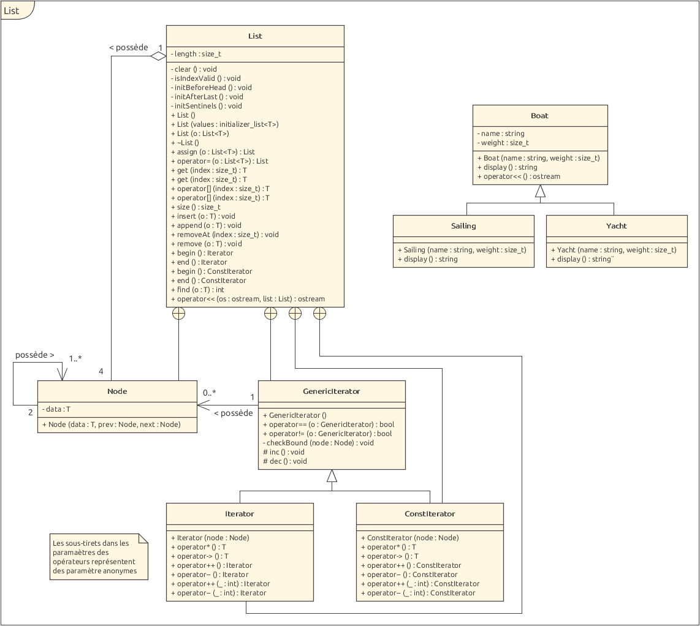
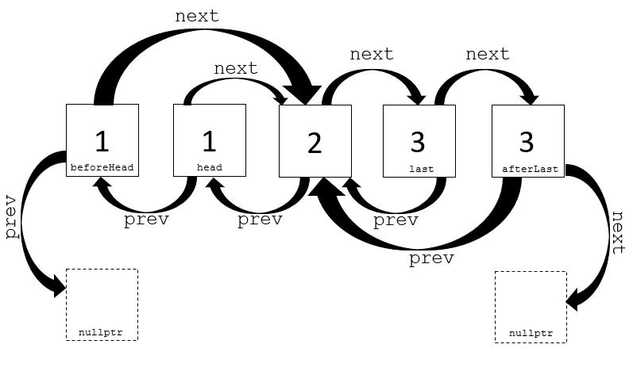

# POO2 - Laboratoire 3 : Liste générique

David Jaquet & Christoph Rouff soit Rueff

## Diagramme de classes

Voici le diagramme des classes de notre implémentation :



Nous ne savions pas si nous devions mettre les notations pointeurs ou références des paramètres. Puisqu'un diagramme de classe doit être le plus éloigné du langage d'implémentation possible nous avons décidé de ne pas les ajouter.

## Choix d'implémentation

### Itérateurs

Pour ce qui est de l'implémentation des itérateurs, nous avons une classe générique `GenericIterator` qui prend en charge l'implémentation des opérateurs `==` et `!=` ainsi que des méthodes `inc()` et `dec()` qui permettent de déplacer le pointeur sur le `Node` visité.

Les classes `Iterator` et `ConstIterator` héritent de `GenericIterator` et implémentent les surcharges d'opérateurs `*, ->, ++it, it++, --it et it--` de manière à ce que `Iterator` permette de modifier la liste parourue sans que ce soit le cas pour `ConstIterator`.

Bien que les opérateurs `++, --` soient les mêmes dans les deux enfants de l'itérateur générique, celui-ci ne les implémente pas car il ne définit pas l'opérateur `*` qui permet, selon si on est dans `Iterator` ou `ConstIterator`, de déréférencer l'itérateur de manière à permettre une modification où non.

### Remove

Pour la méthode `List<T>::remove(const T& o)`, nous ne savions pas si nous devions supprimer la première occurrence de `o` trouvée ou toutes les occurrences. Nous avons décidé d'obtenir le même résultat que la fonction `std::list::remove(const value_type& val)`  de la `STL`. Nous supprimons donc toutes les occurrences trouvées dans la liste correspondant à `o`.

[Page de remove de la STL](http://www.cplusplus.com/reference/list/list/remove/ std::list::remove)

### Noeuds sentinelles

Dans l'exemple d'exécution du code fourni dans la donnée du laboratoire, nous devons pouvoir parcourir la liste dans les deux sens avec les itérateurs fournis par les méthodes `List<T>::begin()` et `List<T>::end()`. Voici l'exemple de code fourni :

```c++
List<string> l;

l.append("un");
l.append("deux");
l.append("trois");

for(List<string>::Iterator it = l.begin(); it != l.end(); ++it){
    cout << *it << " ";
}
cout << endl;
// Affichage: un deux trois

const List<int> c = { 42, 3, 14 };
for(List<int>::ConstIterator it = c.end(); it != c.begin(); --it){
    cout << *it << " ";
}
cout << endl;
// Affichage: 14 3 42
```

A titre de comparaison, la `STL` utilise les fonctions `rbegin()` et `rend` afin d'effectuer la deuxième boucle `for`. Nous ne pouvons donc pas effectuer les même opérations que la `STL`.

Après réflexion avec plusieurs membres de la classe, nous avons décidé d'implémenté deux noeuds sentinelles. Ces sentinelles se trouvent avant le début de la liste et après la fin de la liste. Elle se nomme respectivement `beforeHead` et `afterLast`.



On peut donc voir le noeud `head` a un référence vers le noeuds `beforeHead` comme noeud précédant. Cependant pour ce dernier, la référence vers noeud suivant est la même que le noeud suivant de `head`.

Dit autrement, les instructions suivantes nous fournissent toutes une référence vers le deuxième noeud qui contient la valeur **2** (on ne compte pas les sentinelles dans la numérotation des noeuds). 

```c++
Node *n1 = head->next;
Node *n2 = beforeHead->next;
Node *n3 = head->prev->next;
```

Il est important de noter que nous donnons la même valeur aux noeuds sentinelles que les valeurs de `head`et respectivement `last`.

Les fonctions `List<T>::begin()` et `List<T>::end()` fournissent donc un itérateur pointant vers `beforeHead`et `afterLast`.

Voici donc les instructions exécutée par les boucles `for` fournie en étape par étape avec l'exemple présenté ci-dessus :

```c++
/*for(List<string>::Iterator it = l.begin(); it != l.end(); ++it){
    cout << *it << " ";
}*/
List<string>::Iterator it = l.begin();	// it pointe sur beforeHead
cout << *it << " ";						// Affiche la valeur de beforeHead, 1
++it;									// it pointe le noeud de valeur 2
cout << *it << " ";						// Affiche la valeur 2
++it;									// it pointe sur last
cout << *it << " ";						// Affiche la valeur de last, 3
++it;									// it pointe sur afterLast, l.end() retourne
										// le noeud afterLast, la boucle s'arrête.

/*for(List<int>::ConstIterator it = c.end(); it != c.begin(); --it){
    cout << *it << " ";
}*/
List<string>::ConstIterator it = l.end();	// it pointe sur afterLast
cout << *it << " ";							// Affiche la valeur de afterLast, 3
--it;										// it pointe le noeud de valeur 2
cout << *it << " ";							// Affiche la valeur 2
--it;										// it pointe sur head
cout << *it << " ";							// Affiche la valeur de head, 1
--it;										// it pointe sur beforeHead, l.begin()
											// retourne le noeud afterLast,
											// la boucle s'arrête.
```

## Avantages - Inconvénients

### Sentinelles

Un gros avantages de nos méthodes de sentinelles par rapport à la `STL` et que nous avons utilisons les même méthode pour parcourir la liste dans un sens où dans l'autre. Le parcours de notre liste est plus simple que celui de la `STL` puisque pour parcourir une `std::list` à l'envers, nous devons utiliser les méthodes `rbegin()` et `rend()`.

Cependant, l'utilisation de ces sentinelles tel que nous les avons implémentées nous force à avoir modifier leur valeur à chaque insertion ou suppression de noeud. Cela nous rajoute donc des instructions et donc du temps d'exécution. De plus, la présence de ces sentinelles nous demande également plus de mémoire.